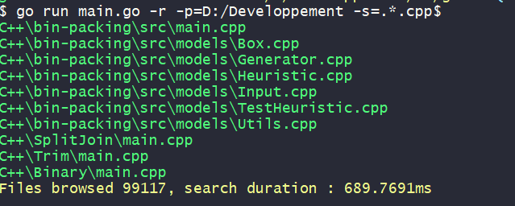
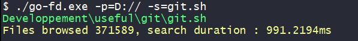
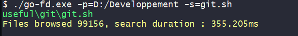

# go-fd

A fast, concurrent file finder.   

# Usage

```sh
go get github.com/1-irdA/go-fd
```

```go
package main

import "github.com/1-irdA/go-fd/finder"

func main() {
	options := finder.Options{
		File:     true,
		Dir:      false,
		Regex:    false,
		Absolute: true,
		Bench:    false,
	}
	fd := finder.New("", "Memoire_GARROUSTE", options)
	fd.Find()
}
```

## Features

```sh
go run main.go -h
go run main.go [-p=path] -s=to-search [-f] [-d] [-a] [-b] [-r]
```

You can search a file by names or with regex.    



## Benchmark

Find in all D:// drive      



Comparison was realised between my concurrent recursive find function and the [Walk function](https://golang.org/pkg/path/filepath/#Walk) from Golang.    

- Walk function


- Concurrent find function

