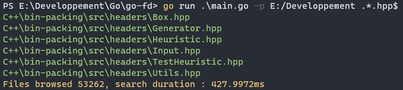
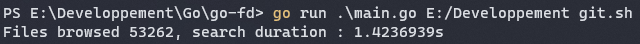
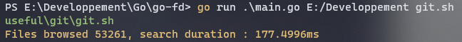

# go-fd

A fast, concurrent file finder.   

## Features

```sh
go run main.go -h
go run main.go dir to-search
go run main.go -p dir to-search
```

You can search a file by names or with regex.    



## Benchmark

Comparison was realised between my concurrent recursive find function and the [Walk function](https://golang.org/pkg/path/filepath/#Walk) from Golang.    

- Walk function



- Concurrent find function

